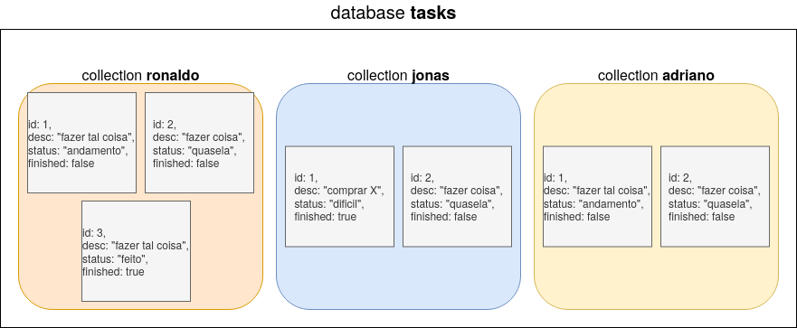

# todo-api
API REST de uma aplicação de *TO-DO List* com integração ao MongoDB, permite a diferentes usuários:
- criar/editar tarefas;
- deletar tarefas;
- listar todas as suas tarefas ou aplicar filtro de status;
- completar tarefas, que são movidas para uma outra listagem;
- restaurar tarefas já completadas, fazendo assim com que elas voltem para a listagem principal;

## Utilização
1. Caso não possua uma instalação local do MongoDB, realize o deploy de um container Docker expondo a porta padrão ao host
	```
	docker pull mongo
	docker run -p 27017:27017 mongo
	```

2. Compile e execute a aplicação pelo diretório raiz, ou execute o container Docker compartilhando rede com o host
	```
	docker build . -t todo-api 
	docker run --network=host todo-api
	```

3. Pronto! Siga a documentação da API enviando requisições HTTP ao endereço ```localhost:8181```.


## Documentação da API
Além de descrita aqui, a documentação completa da API encontra-se disponível no próprio repositório público do Postman, no [seguinte link](https://documenter.getpostman.com/view/13469996/TVenf8V2).

### Listando tarefas
* **GET** ```localhost:8181/tasks/```
	- ```usr```: especifica o usuário dono das tasks.
	- ```status``` (opcional): diferentes status separados por vírgulas, permitem a filtragem de tarefas por diferentes status.

### Criando tarefas
* **POST** ```localhost:8181/tasks/```
	- ```usr```: especifica o usuário dono das tasks.
	- Body com arquivo JSON do tipo:
		```json
		{
    		"desc": "passo1 da api",
    		"status": "andamento"
		}
		```
	* **OBS:** Não é necessário informar o ID da tasks, ele é automaticamente atribuído durante inserção. Por padrão, todas tarefas iniciam como não finalizadas.

### Editando tarefas
* **PUT** ```localhost:8181/tasks/```
	- ```usr```: especifica o usuário dono das tasks.
	- ```id```: identificador da tarefa que deseja-se editar.
	- ```desc```: nova descrição a ser atribuída a tarefa.
	- ```status```: novo status a ser atribuída a tarefa.

### Completando tarefas
* **GET** ```localhost:8181/tasks/complete/```
	- ```usr```: especifica o usuário dono das tasks.
	- ```id```: identificador da tarefa que deseja-se completar.

### Restaurando tarefas
* **GET** ```localhost:8181/tasks/restore/```
	- ```usr```: especifica o usuário dono das tasks.
	- ```id```: identificador da tarefa que deseja-se restaurar (marcar novamente como não-concluida).


## Armazenamento no MongoDB
A Figura abaixo ilustra a maneira como os dados são organizados no banco de dados. Além dos campos de cada documento, é possível perceber que tarefas de cada usuário são armazenadas em *collections* distintas.

